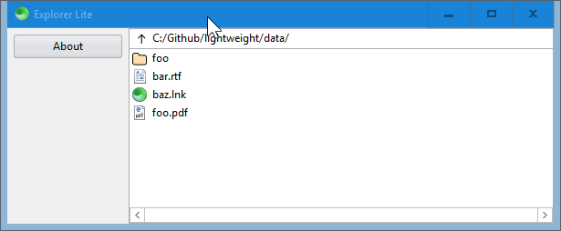

<h1 align="center">
  <b>Explorer<i>lite</i></i>
   
   
  </a>
   
   
</h1>

## What is this?

It's a file explorer restricted to certain folders and file types.  It's basically a clone of [this](https://github.com/c-smile/sciter-js-sdk/tree/main/samples.sciter/sys) official example with a few tiny modifications.

## But why though?

It was requested [here](https://www.donationcoder.com/forum/index.php?topic=50804.0).

## How to use it?

Run [`scapp.exe`](https://github.com/c-smile/sciter-js-sdk/blob/main/bin/windows/x64/scapp.exe) in this folder.

## Before they invented drawing boards, what did they go back to?

